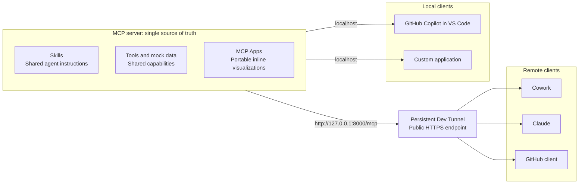

# Bottom-Up MCP Apps and Skills

This repository demonstrates how to keep an agent truly independent from any
one MCP client. The MCP server is the source of truth: it publishes its tools,
portable MCP Apps, and Skills so every compatible client can discover the same
capabilities, instructions, and user interface.

The example is a team-delivery assistant. One MCP server exposes mock team data,
three chart tools rendered as MCP Apps, and three reusable Skills:

- `weekly-delivery-summary`
- `team-workload`
- `delivery-risk`

The same server can be used from Cowork, Claude, GitHub Copilot in VS Code, and
a custom application. The agent behavior comes from the server and its Skills,
while visualizations come from MCP Apps rather than client-specific rendering
code.

## Why this matters

### One visualization, reusable across clients

Many MCP integrations return structured data and then rely on each client to
implement a custom visualization. That couples the experience to client-specific
code: every client needs its own chart components, data mapping, styling, and
maintenance. A visualization built for one client cannot simply be reused by
another.

This repository demonstrates the MCP Apps approach instead. The chart UI is
declared by the MCP server and delivered through the MCP protocol. Clients that
support MCP Apps can render the same bar, line, and pie chart experiences inline
without reimplementing them. The visualization travels with the capability, so
adding another compatible client does not require another custom UI integration.

### One instruction source, consistent agent behavior

Putting MCP-specific instructions into each client's system prompt creates a
second portability problem. Cowork, Claude, GitHub Copilot, VS Code, and a custom
agent would each maintain a separate copy. Those copies inevitably drift as
prompts are edited, capabilities evolve, or one integration is updated before
the others. The same user request can then produce different tool choices and
different behavior depending on the client.

The Skills in this repository keep task guidance with the MCP server capability.
Each client receives the same workflow definitions for delivery summaries,
workload analysis, and delivery risk. Client configuration is limited to
connecting to the server; domain instructions remain server-owned, reusable,
and versioned alongside the tools they describe.

## Architecture



Every client receives the same server-owned instructions, tools, and MCP App UI.
Only the connection path changes: remote clients use the HTTPS tunnel, while
local clients connect directly to localhost.

## Prerequisites

- Python 3.13 or later
- [`uv`](https://docs.astral.sh/uv/)

## Run the MCP server locally

From the repository root:

```powershell
cd mcp_servers/data_server
uv sync
uv run python main.py
```

The Streamable HTTP endpoint is available at:

```text
http://127.0.0.1:8000/mcp
```

Keep this terminal running while using any integration. Then choose a client
below and continue in its README.

## Repository layout

| Area | Purpose | Continue here |
| --- | --- | --- |
| MCP data server | Tools, MCP Apps, mock data, and canonical Skills | [Server README](mcp_servers/data_server/README.md) |
| Cowork plugin | Skills and remote MCP connection for Cowork | [Cowork README](integrations/cowork_plugin/README.md) |
| Claude plugin | Skills and remote MCP connection for Claude | [Claude README](integrations/claude_plugin/README.md) |
| GitHub integration | Remote GitHub client connection | [GitHub README](integrations/github_plugin/README.md) |
| Custom app | Agent Framework backend and MCP Apps frontend | [Custom app README](integrations/custom_app/README.md) |
| VS Code | Local GitHub Copilot connection | [VS Code README](.vscode/README.md) |
