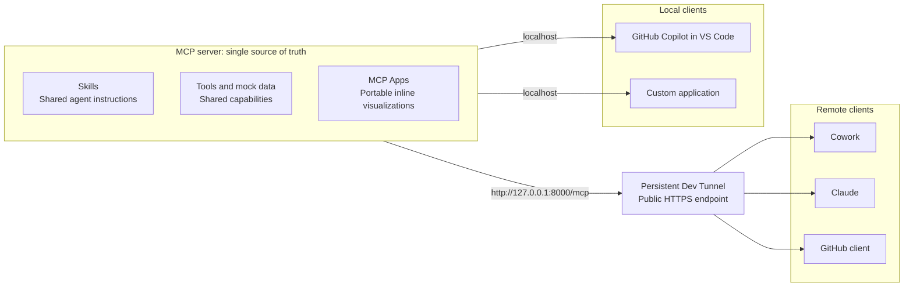

# Bottom-Up MCP Apps and Skills

This repository demonstrates how to keep an agent truly independent from any
one MCP client. The MCP server is the source of truth: it publishes its tools,
portable MCP Apps, and Skills so every compatible client can discover the same
capabilities, instructions, and user interface.

The example is a team-delivery assistant. One MCP server exposes mock team data,
three chart tools rendered as MCP Apps, and three reusable Skills:

- `weekly-delivery-summary`
- `team-workload`
- `delivery-risk`

The same server can be used from Cowork, Claude, GitHub Copilot in VS Code, and
a custom application. The agent behavior comes from the server and its Skills,
while visualizations come from MCP Apps rather than client-specific rendering
code.

## Why this matters

### One visualization, reusable across clients

Many MCP integrations return structured data and then rely on each client to
implement a custom visualization. That couples the experience to client-specific
code: every client needs its own chart components, data mapping, styling, and
maintenance. A visualization built for one client cannot simply be reused by
another.

This repository demonstrates the MCP Apps approach instead. The chart UI is
declared by the MCP server and delivered through the MCP protocol. Clients that
support MCP Apps can render the same bar, line, and pie chart experiences inline
without reimplementing them. The visualization travels with the capability, so
adding another compatible client does not require another custom UI integration.

### One instruction source, consistent agent behavior

Putting MCP-specific instructions into each client's system prompt creates a
second portability problem. Cowork, Claude, GitHub Copilot, VS Code, and a custom
agent would each maintain a separate copy. Those copies inevitably drift as
prompts are edited, capabilities evolve, or one integration is updated before
the others. The same user request can then produce different tool choices and
different behavior depending on the client.

The Skills in this repository keep task guidance with the MCP server capability.
Each client receives the same workflow definitions for delivery summaries,
workload analysis, and delivery risk. Client configuration is limited to
connecting to the server; domain instructions remain server-owned, reusable,
and versioned alongside the tools they describe.

## Architecture



Every client receives the same server-owned instructions, tools, and MCP App UI.
Only the connection path changes: remote clients use the HTTPS tunnel, while
local clients connect directly to localhost.

## Repository layout

| Area | Purpose | Guide |
| --- | --- | --- |
| MCP data server | Owns the tools, MCP Apps, mock data, and canonical Skills | [Server README](mcp_servers/data_server/README.md) |
| Cowork plugin | Packages the Skills and remote MCP connection for Cowork | [Cowork README](integrations/cowork_plugin/README.md) |
| Claude plugin | Packages the Skills and remote MCP connection for Claude | [Claude README](integrations/claude_plugin/README.md) |
| GitHub integration | Describes the remote-client connection boundary | [GitHub README](integrations/github_plugin/README.md) |
| Custom app | Runs an Agent Framework backend and MCP Apps frontend locally | [Custom app README](integrations/custom_app/README.md) |
| VS Code | Connects directly through `.vscode/mcp.json` | [VS Code setup](#use-the-server-from-vs-code) |

## Prerequisites

- Python 3.13 or later
- [`uv`](https://docs.astral.sh/uv/)
- [Dev Tunnels CLI](https://learn.microsoft.com/azure/developer/dev-tunnels/get-started) for remote clients
- Node.js and npm for the custom frontend
- Client-specific tooling described in each integration README

## Run the MCP server locally

From the repository root:

```powershell
Set-Location mcp_servers/data_server
uv sync
uv run python main.py
```

The Streamable HTTP endpoint is available at:

```text
http://127.0.0.1:8000/mcp
```

Keep this terminal running while using any integration. See the
[server README](mcp_servers/data_server/README.md) for the tools and demo prompts.

## Create a persistent Dev Tunnel

Cowork, Claude, and remote GitHub clients cannot reach your machine's localhost.
Expose port `8000` through an anonymous, persistent HTTPS tunnel. A persistent
tunnel keeps the same URL when it is stopped and hosted again.

Install the CLI on Windows if needed, sign in, and create the tunnel once:

```powershell
winget install Microsoft.devtunnel
devtunnel user login
devtunnel create my-mcp-tunnel --allow-anonymous
devtunnel port create my-mcp-tunnel -p 8000 --protocol http
```

The protocol is `http` because the local MCP server listens over HTTP. The Dev
Tunnel supplies the public HTTPS endpoint. The name identifies the persisted
tunnel configuration. Start that same tunnel whenever you run the demo:

```powershell
devtunnel host my-mcp-tunnel
```

Copy the `Connect via browser` URL printed by the CLI and append `/mcp`:

```text
https://<tunnel-host>.devtunnels.ms/mcp
```

On first use, open the browser URL and select **Continue** to enable it. Keep the
tunnel process running during remote tests. Running
`devtunnel host my-mcp-tunnel` again reuses this URL. Anonymous access is
required by the demo clients, so do not expose sensitive tools or data through
this tunnel.

## Configure remote clients

Replace the existing MCP URL with the static tunnel URL, including `/mcp`, in:

- `integrations/cowork_plugin/manifest.json`
- `integrations/claude_plugin/.mcp.json`
- Any remote GitHub client configuration described in the [GitHub guide](integrations/github_plugin/README.md)

Use the same URL in every remote client. Do not create a temporary tunnel with
`devtunnel host -p 8000` for this workflow; its URL is deleted when it stops.

Continue with the [Cowork](integrations/cowork_plugin/README.md) or
[Claude](integrations/claude_plugin/README.md) packaging instructions.

## Use the server from VS Code

VS Code runs on the same machine as the server, so no tunnel is required. The
checked-in `.vscode/mcp.json` points to `http://127.0.0.1:8000/mcp`.

1. Start the MCP server locally.
2. Open this repository in VS Code.
3. Start or refresh the `mock_data_server` entry in the MCP Servers view.
4. Open Copilot Chat in agent mode and try one of the prompts below.

## Use the custom app

The custom backend and frontend also connect over localhost. Start the MCP server
first, then follow the [custom app README](integrations/custom_app/README.md).
No Dev Tunnel URL is needed for this path.

## Try the demo

```text
Give me the weekly delivery summary.
Who is above or below weekly capacity?
Where is blocked work putting delivery at risk?
```

Across clients, the expected behavior is the same: a Skill steers the agent,
the agent calls the shared data and chart tools, and the client renders the MCP
App without requiring a proprietary response format.
